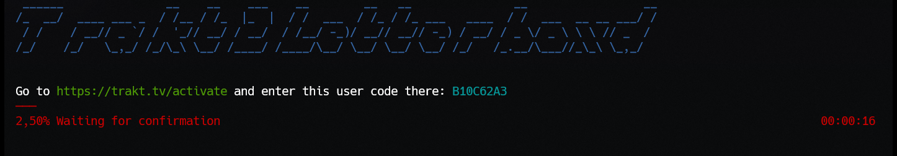

# Trakt 2 Letterboxd

[Trakt.tv](https://www.trakt.tv) movies history export for [Letterboxd](https://www.letterboxd.com) inspired by [Trakt2Letterboxd](https://github.com/anoopsankar/Trakt2Letterboxd).
Since I wanted to export my ratings as well, I write my small little console app. Do not expect much cutesy as this was one time import. But it maybe useful for other movie folks out there.
Till **Letterboxd** provides a public API.

## Usage

Just run your usual ```dotnet run --project Trakt2Letterboxd```

## Device auth

I kept ```ClientId``` and ```ClientSecret``` in source code. If you are extremely paranoid just register your own Trakt API application. Use this Redirect Url: ```urn:ietf:wg:oauth:2.0:oob```

When started you will be asked to open URL and enter your code. Do it... you have some time.



## Grabbing

The rest is automatic. Application is going to grab all your movies history and ratings and created CSV file to be imported in **Letterboxd** named ```trakt-exported-history.csv```


## Auth token

Auth token is saved into ```.token``` file and is valid 3 months. So you are not gonna need it probably for the second time anyway. Unless you are the king of procrastination.

MIT © [frohikey](http://frohikey.com)